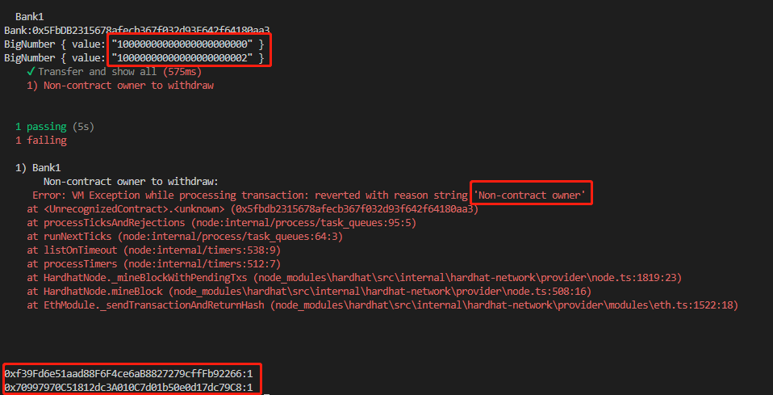

## 通过Hardhat部署合约：

sepolia交易哈希：0xd7a23acb0c12e0999abc986d6838bcb4dd9c9892ddf26cadd8e9d81ea45bc379

goerli交易哈希：0xf9bc7e08138b23800c3897ee949ae9cd196dfc91c8adb4fc162fdec638575c69

sepolia测试网合约地址：https://sepolia.etherscan.io/address/0x8A96937304F2FfDBA6Fa4BDe7B760814c18902fE#code 

goerli测试网合约地址：https://goerli.etherscan.io/address/0x72f50a2E4D8dBe6e65C1f543D7e4C45b3A651400#code

## 通过MetaMask给合约转账：

交易哈希：0x4f1785d5dee34583b7dba6eaf8252e06e9e31b79c491a13dc1853818812a87b6
 

合约金额：

 

## 测试

 

第一个进行了转账并显示所有.

第二个为不是合约拥有者提取合约余额失败.

## 事件说明：

1. 调用的函数： receive
2. 来自谁的转账：0x8B5B88cC81439CbB14eF9017AbC9F7E62635fb31
3. 金额：1000000000000000 wei
4. 数据：空

 
