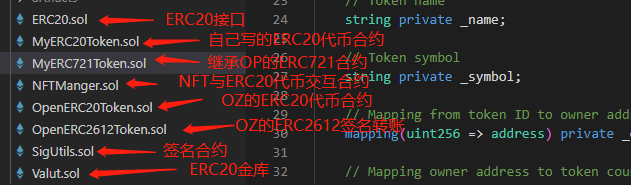
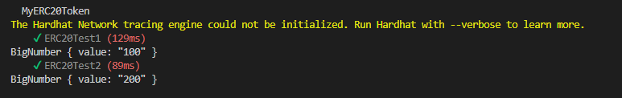
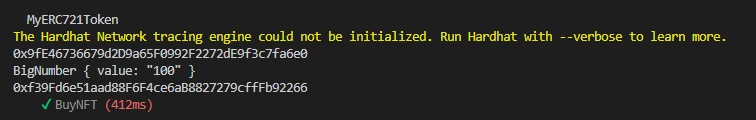
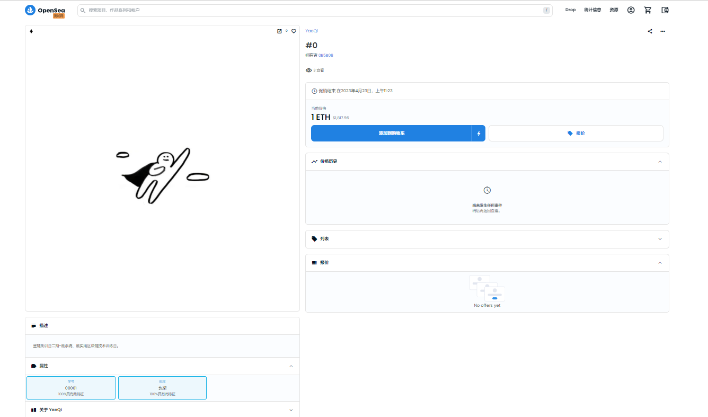

# 合约列表

 

# 测试

ERC20:第一个测试是基础的先授权后转账成功，第二个测试是通过回调直接完成转账成功.

 

ERC2612通过签名授权然后转账...

在社区看到这段话：两个交易是由`user2`调用的。 `user1`是`holder`，是创建`digest`并签名的用户。 但是，`user1`并没有花费任何gas。

`user1`将签名提供给`user2`，后者使用它来执行`user1`授权的 `permit` 和`transferFrom`。

permit只有授权，还是要进行两次调用合约，只是两次都是由收款方调用，是不是逻辑少了一点，因为签名可以线下，所以可以节省一点Gas费，不知道这样理解对不对..0.0

 

ERC721购买NFT，做这个的时候我想的是写一个NFT和Token的中间商，铸造NFT时铸造地址是中间商合约地址，然后在中间商中进行限制，但是好像这样的话只在固定的Token中才能用，有点混乱，感觉自己写的合约一坨......算是一次尝试吧.

测试也是两次调用合约，买家通过授权卖家转账自己的Token，然后卖家通过提现后自动将NFT主人移交给买家，大概就是这样.

 

ERC721部署在Goerli测试网上，合约地址：0x8A96937304F2FfDBA6Fa4BDe7B760814c18902fE

NFT链接地址：https://testnets.opensea.io/zh-CN/assets/goerli/0x8a96937304f2ffdba6fa4bde7b760814c18902fe/0

 

